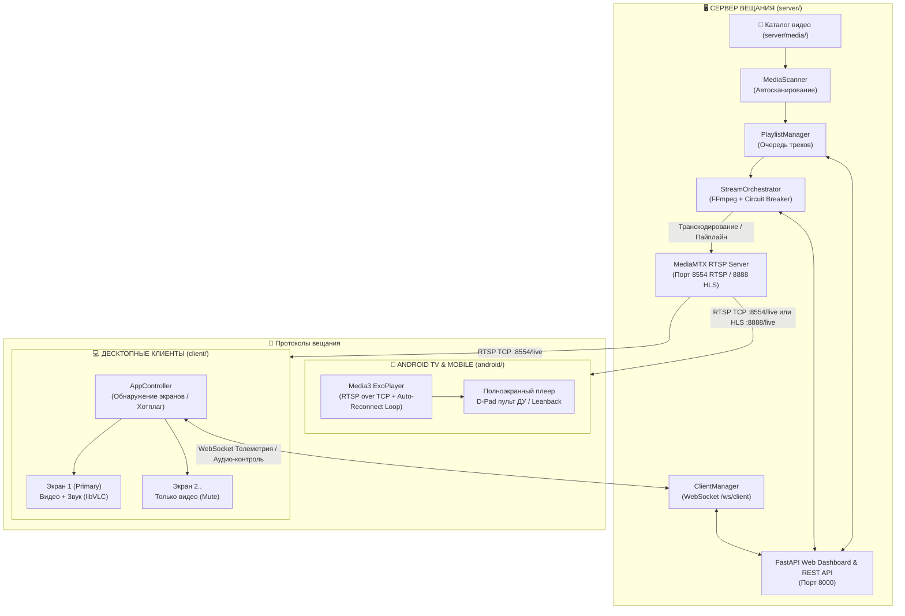

# 📺 Continuous Broadcast Video System (`videoTVTranslation`)

Комплексная распределенная система непрерывного (24/7) вещания видеоконтента по протоколам **RTSP** и **HLS** с автоматической синхронизацией и воспроизведением на множестве физических экранов: мультимониторных десктопных рабочих станциях (Windows/Linux) и телевизорах / медиаприставках **Android TV**.

---

## 🏗️ Архитектура системы



---

## 📁 Структура проекта

Проект логически разделен на три независимых компонента и общие конфигурационные файлы:

```text
videoTVTranslation/
├── README.md                   # Данный презентационный файл
├── PROJECT_OVERVIEW.md         # Детальное архитектурное руководство разработчика
├── AGENTS.md                   # Инструкции и правила для AI-агентов
├── run_tests.py                # Единый запуск всех модульных тестов (76 тестов)
│
├── server/                     # 🖥️ СЕРВЕРНАЯ ЧАСТЬ (FastAPI, MediaMTX, FFmpeg)
│   ├── README.md               # Подробная инструкция: установка, Docker, запуск, API
│   ├── run.py                  # Точка входа сервера с предстартовой диагностикой
│   ├── main.py                 # FastAPI приложение (REST API, WebSocket, Web UI)
│   ├── mediamtx.exe, .yml      # Локальный RTSP/HLS медиасервер
│   ├── Dockerfile, compose.yml # Контейнеризация сервисов
│   └── ...
│
├── client/                     # 💻 ДЕСКТОПНЫЙ КЛИЕНТ (PyQt6, libVLC)
│   ├── README.md               # Подробная инструкция: установка, компиляция EXE, запуск
│   ├── main.py                 # Точка входа десктопного плеера
│   ├── app_controller.py       # Мультиэкранный оркестратор и WebSocket клиент
│   ├── player_window.py        # Безрамочное окно плеера (аппаратный libVLC)
│   └── ...
│
└── android/                    # 📱 ANDROID TV & MOBILE КЛИЕНТ (Kotlin, Media3)
    ├── README.md               # Подробная инструкция: сборка APK, ADB, Leanback UI
    ├── app/                    # Исходный код Android приложения
    ├── build.gradle.kts        # Скрипты сборки Gradle
    └── ...
```

---

## ⚡ Краткий обзор компонентов

| Компонент | Назначение | Основные технологии | Ссылка на документацию |
|---|---|---|---|
| **Сервер (`server/`)** | Сканирование медиа, бесшовный плейлист, перекодирование FFmpeg, раздача RTSP/HLS, веб-панель управления оператора, WebSocket-телеметрия клиентов. | Python 3.11+, FastAPI, MediaMTX, FFmpeg, Jinja2 | 👉 [server/README.md](file:///c:/Users/zqrey3/Desktop/Scritps/Python/videoTVTranslation/server/README.md) |
| **Десктопный клиент (`client/`)** | Автоматическое развертывание на все физические мониторы ПК, синхронный показ, подача звука только на Primary монитор, горячие клавиши, удаленный контроль. | Python 3.10+, PyQt6, libVLC (python-vlc), WebSocket | 👉 [client/README.md](file:///c:/Users/zqrey3/Desktop/Scritps/Python/videoTVTranslation/client/README.md) |
| **Android TV клиент (`android/`)** | Полноэкранный плеер для ТВ-боксов и 스마트-ТВ с поддержкой пультов ДУ, принудительного RTSP over TCP и защитой от обрывов сети. | Kotlin, AndroidX Media3 (ExoPlayer 1.3.1), Leanback, DataStore | 👉 [android/README.md](file:///c:/Users/zqrey3/Desktop/Scritps/Python/videoTVTranslation/android/README.md) |

---

## 🚀 Быстрый запуск

### 1. Сервер вещания
```powershell
cd server
python run.py
```
> Веб-интерфейс управления откроется по адресу: **`http://localhost:8000`**

### 2. Десктопный клиент
```powershell
cd client
python main.py
```
> Плеер мгновенно откроется на всех мониторах. Клавиша **`Q`** открывает настройки, **`E`** — закрытие.

### 3. Сборка клиента Android TV
```powershell
cd android
./gradlew assembleDebug
```
> Готовый APK: `app/build/outputs/apk/debug/app-debug.apk`

---

## 🧪 Запуск автоматических тестов

В репозитории реализован полный набор модульных и интеграционных тестов:

```powershell
python run_tests.py
```

```text
======================================================================
ЗАПУСК ВСЕХ МОДУЛЬНЫХ И ИНТЕГРАЦИОННЫХ ТЕСТОВ ПРОЕКТА
======================================================================
--- [1/2] Запуск тестов сервера (server/tests) ---
Ran 61 tests in 1.4s -> OK

--- [2/2] Запуск тестов клиента (client/tests) ---
Ran 15 tests in 0.1s -> OK
======================================================================
[OK] ВСЕ ТЕСТЫ СЕРВЕРА И КЛИЕНТА УСПЕШНО ПРОЙДЕНЫ! (Сервер: 61, Клиент: 15 — Всего: 76 тестов)
======================================================================
```

---

## 📚 Дополнительная документация
- **[PROJECT_OVERVIEW.md](file:///c:/Users/zqrey3/Desktop/Scritps/Python/videoTVTranslation/PROJECT_OVERVIEW.md)** — полное описание протоколов, сетевого взаимодействия, защиты от дедлоков и файловых блокировок Windows.
- **[AGENTS.md](file:///c:/Users/zqrey3/Desktop/Scritps/Python/videoTVTranslation/AGENTS.md)** — регламент и правила разработки для AI-агентов.
